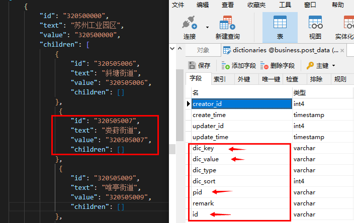
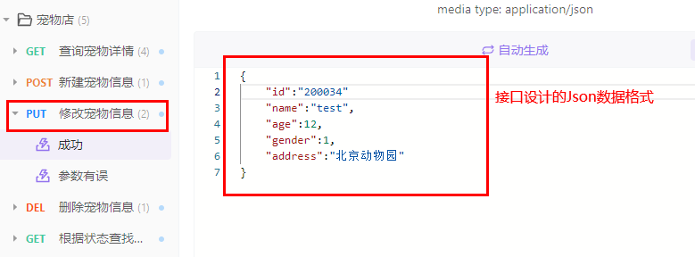

# 了解本站

### 为何问世

:::tip 答：
在不久之前，作者接到了组长交给我的一个JSON数据文件，需要将JSON中的数据初始化到数据库表中，
该JSON数据文件包含某市本地的所有区以及街道的数据，将其初始化到字典表中，但是数据中的区和街道
的数据达到了上百条，而且市、区、街道数据之间各种嵌套，看的真是令人头皮发麻，
拿到这个任务，首先想到的是使用Navicat进行JSON格式的导入功能，但是在操作的过程中我发现，数据中夹杂着太多的
children父子级嵌套关系，而且JSON中的字段和数据库中的字段竟然很惊人的不一致，这种情况出奇的恶心，于是就怀着一种侥幸的心理
在百度和Google之间进行来回穿梭，但最终都是以无果而告终！其间找到了一个有点意思的工具进行对JSON进行处理，但最终还是不能达到
我想要的那种解决方式（可以替换属性、而且可以一次性将可执行性SQL全部生成）。
:::


### 解决痛点

下面就让我来给大家介绍一下[ST](https://github.com/pdxjie/sql-translate) 可以解决哪些痛点问题：
- 需要将大量JSON中的数据导入到数据库中，但是JSON中包含大量父子嵌套关系 ——> [可以使用本站](http://www.json-sql.com)
- 在进行JSON数据导入数据库时，遇到JSON字段与数据库字段不一致需要替换字段时 ——> [可以使用本站](http://www.json-sql.com)
- 根据Apifox工具来实现更新或新增接口（前提是对接口已经完成了设计工作），提供了Body体数据，而且不想手动编写SQL时 ——> [可以使用本站](http://www.json-sql.com)

对上述三点进行进行举例说明（按照顺序）：

第一种情况：
```json
{
    "id": "320500000",
    "text": "苏州工业园区",
    "value": "320500000",
    "children": [         
        {
            "id": "320505006",
            "text": "斜塘街道",
            "value": "320505006",
            "children": []
        },
         {
            "id": "320505007",
            "text": "娄葑街道",
            "value": "320505007",
            "children": []
        },
      ....
    ]
}
```
第二种情况：


第三种情况：
