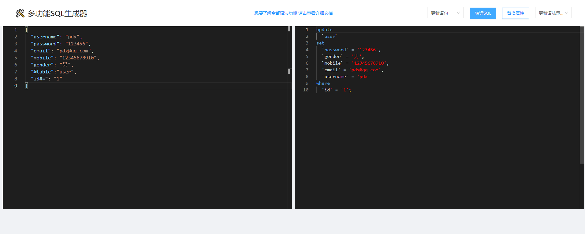
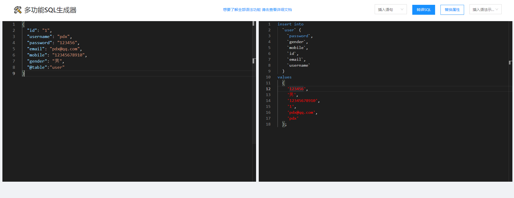

# 快速开始
先通过三个简单的Demo来阐述Sql-Translation的功能，在此之前，在每一个测试Demo之前提供一个`JSON`块
- 熟悉JSON数据格式
- 熟悉MySQL语法


### 生成create table语句
现有一段JSON数据，其数据如下：

```json
{
  "id": "1",
  "username": "pdx",
  "password": "123456",
  "email": "pdx@qq.com",
  "mobile": "12345678910",
  "gender": "男"
}
```
需求：现在需要根据这段JSON数据，生成一个表名为`user`的表
```json
{
  // @后面指定字段长度
  "id@12": "1",
  "username@30": "pdx",
  "password@30": "123456",
  "email@30": "pdx@qq.com",
  "mobile@11": "12345678910",
  "gender@1": "男",
  // @table 指定生成的表名
  "@table": "user"
}
```
具体create table 操作展示：


### 生成update where语句
现有一个更新操作的接口，其设计的输入Body体中的JSON数据格式如下：

```json
{
  "username": "pdx",
  "password": "123456",
  "email": "pdx@qq.com",
  "mobile": "12345678910",
  "gender": "男"
}
```
需求：现在需要根据id进行修改上述user实体信息
```json
{
  "username": "pdx",
  "password": "123456",
  "email": "pdx@qq.com",
  "mobile": "12345678910",
  "gender": "男",
  // @table 指定更新操作的表
  "@table":"user",
  //使用 # 号分隔条件字段 和 操作符号
  "id#=": "1"
}
```
具体 update where操作展示：


### 生成insert into语句
现有一段JSON数据，其数据如下：

```json
{
  "id": "1",
  "username": "pdx",
  "password": "123456",
  "email": "pdx@qq.com",
  "mobile": "12345678910",
  "gender": "男"
}
```
任务：将上述JSON中的数据添加到user表中

```json
{
  "id": "1",
  "username": "pdx",
  "password": "123456",
  "email": "pdx@qq.com",
  "mobile": "12345678910",
  "gender": "男",
  // @table指定要生成插入语句的表名
  "@table":"user"
}
```
具体 insert into 操作展示：



### 小结
通过上述三个示例，可以大致了解ST工具实现的功能，主要是根据JSON生成一些建表、更新、插入格式的SQL语句，
但 Sql-Translation 功能可不仅目前看到的这些，想要详细了解 Sql-Translation 的更多功能？那就继续往下看吧！

