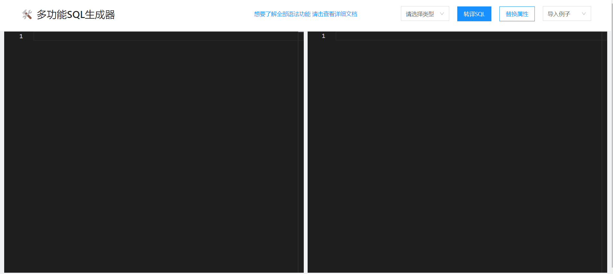

# 替换属性
::: tip 解释说明
一般当JSON中的字段和对应数据库表中的字段不一致时，需要用到属性替换功能；
该功能在本站三种操作模式上都适用
:::

### 快速测试

#### create table 操作模式
假设现有一段JSON数据，如下所示：
```json
{
  "id": "123",
  "userName": "pdx",
  "passWord": "123456",
  "@table": "user"
}
```
**需求：数据库字段为`user_name`、`pass_word`，使用属性替换生产建表SQL语句**<br>
<br>
页面实际操作如下：


输出SQL结果如下显示：
```sql
create table `user`(
  `id` varchar(12),
  `pass_word` varchar(30),
  `user_name` varchar(24)
);
```

#### update where 操作模式
假设现定义了一个更新用户信息的接口，其中接口接收的Body体的JSON数据如下(按照id修改)：
```json
{
  "id": "123",
  "username": "pdx",
  "password": "123456"
}
```
需求:数据库对应的字段分别为：`user_name`、`pass_word`，并将信息修改为如下：
```json
{
    "username":"admin",
    "password":"123456"
}
```
页面实际操作如下：


输出SQL结果如下显示：
```sql
update
  `user`
set
  `pass_word` = '123456',
  `user_name` = 'admin'
where
  `id` = '1';
```

#### insert into 操作模式
假设现有一段JSON数据，需要将这些数据初始化到数据库表中，数据如下：
```json
{
    "id": "320500000",
    "text": "苏州工业园区",
    "value": "320500000",
    "value": "320500000",
    "children": [         
        {
            "id": "320505006",
            "text": "斜塘街道",
            "value": "320505006",
            "children": []
        },
         {
            "id": "320505007",
            "text": "娄葑街道",
            "value": "320505007",
            "children": []
        },
         {
            "id": "320505009",
            "text": "唯亭街道",
            "value": "320505009",
            "children": []
        },
         {
            "id": "320505010",
            "text": "胜浦街道",
            "value": "320505010",
            "children": []
        },
        {
            "id": "320505012",
            "text": "金鸡湖街道",
            "value": "320505012",
            "children": []
        }
    ]
}
```

需求：将上述JSON数据初始化到数据库表中，但该数据中的字段与需要转译的数据库表中的字段有所差别，假设表中的字段名称分别为
`id`、`value` <===> `dic_key`、`text` <===>`dic_value`且从数据格式上看，是包含父子级嵌套的，
而数据库中也包含`pid`属性，生成可执行的插入SQL脚本

具体操作如下：


输出的SQL如下所示：
```sql
insert into
  `dic` (`dic_key`, `pid`, `dic_value`, `id`)
values
  ('320500000', '0', '苏州工业园区', '320500000'),
  ('320505006', '320500000', '斜塘街道', '320505006'),
  ('320505007', '320500000', '娄葑街道', '320505007'),
  ('320505009', '320500000', '唯亭街道', '320505009'),
  ('320505010', '320500000', '胜浦街道', '320505010'),
  ('320505012', '320500000', '金鸡湖街道', '320505012');
```
