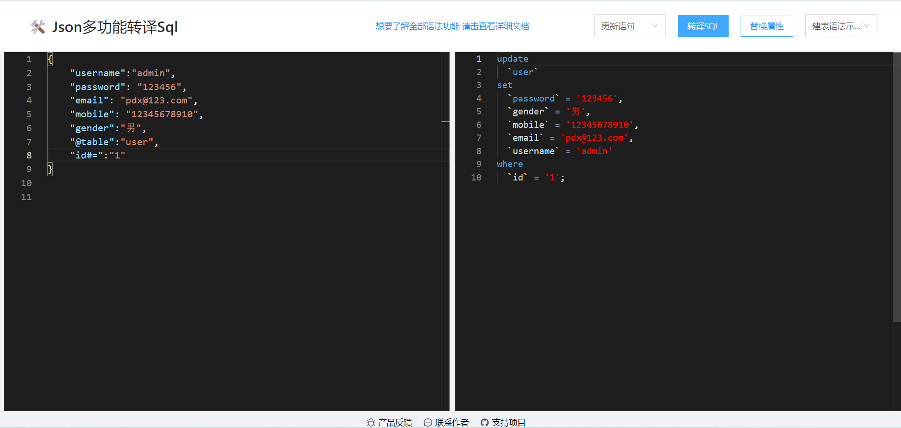
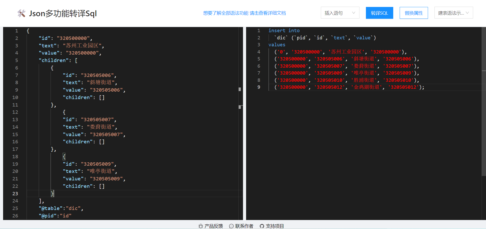
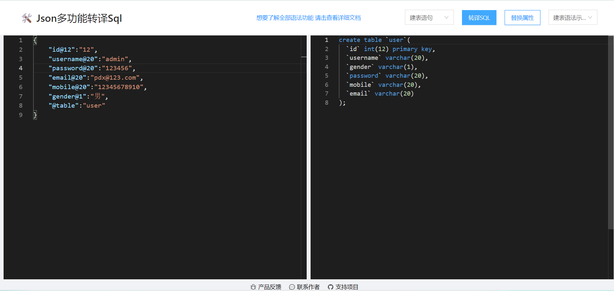
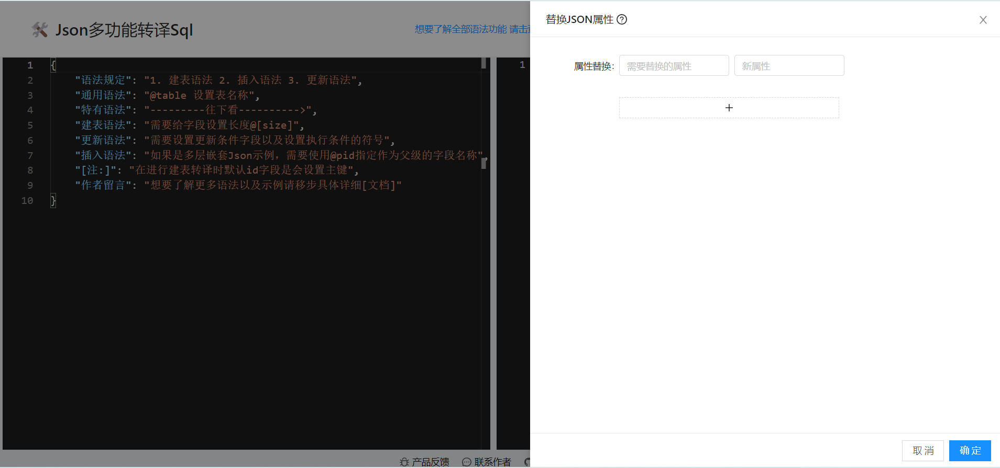
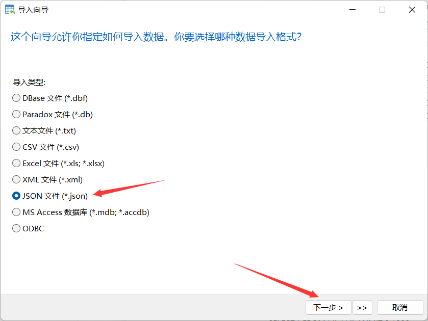
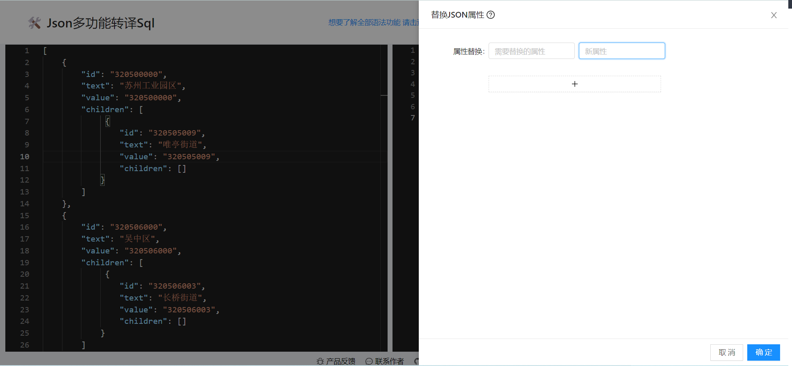

## 多功能SQL生成器
<hr>
尝鲜体验：http://Json-sql.cn<br/>
目前该版本主要包含<b>三种操作模式</b>：

- Json生成 create table 语句
- Json生成 update where 语句
- Json生成 insert into 语句

#### 三种操作模式所具备的特点：
Json生成建表语句默认支持id属性为主键<br/>
Json生成更新语句支持但条件或多条件更新<br/>
Json生成插入语句支持单条插入操作、Json嵌套生成多条数据插入语句<br/>
#### 语言是模糊的，下面先通过图来展示三种操作模式所达成效果示意：
##### 1. Json生成 update where 语句



##### 2. Json生成 insert into 语句 



##### 3. Json生成 create table 语句 



#### 项目作用：

1. 将接口定义的JSON转译为 SQL语句，无需动手编写SQL
2. 支持多层嵌套JSON语句块转译为Insert SQL语句，一键执行插入操作得到初始化数据脚本
3. 可以对JSON块部分以及全部字段进行替换，便于和数据库表中的字段保持一致，得到更正确的SQL语句



#### 适用场景：
1. 如果你需要拿到Json脚本需要去初始化表数据，数据量达到了上百条甚至上千条，且Json脚本中的字段key与数据库表中的字段不一致以至于无法直接使用Json脚本导入数据时，推荐你使用该工具，可以避免手动单条插入数据，减少时间消耗。
2. 如果需要根据(Apifox/PostMan)事先定义好的接口中Mock数据去实现具体的功能时，避免不了书写实际的增删改查SQL语句与数据库做交互，那么推荐你使用该工具，使用定义好的Json格式的数据，根据相应的语法去转译称为你需要的SQL语句，在一些简单的工作上减低时间成本。

#### 产生背景：
之所以会想到造这个轮子，也正是因为派大星在实际工作中被安排去初始化数据库数据，拿到一个上百条数据的Json脚本，本以为可以使用Navicat直接Json导入数据，奈何字段名称不一致，数据量太大的话手动插入数据人是会疯掉的！

#### 优势：
1. 支持在线编辑JSON代码，支持代码高亮、语法校验、代码格式化、查找和替换、代码块折叠等，体验良好
2. 支持一键生成SQL
3. 支持JSON嵌套数据生成SQL，主要应用于有父子级关系的数据库模型中
4. 支持特定的语法来实现不同的效果
5. 支持JSON字段的替换来达到和数据库表中的字段一致的效果，以至于转移成为真正可用的SQL

#### 语法说明：
| 语法key | value | 解释说明 |
| ------ | ------ | ------ | 
| @table | 表名 | 示例："@table":"user"，三种操作模式中必须项 |
| @[size] | 字段大小 | 示例："key@12":"value"，在create table 模式中使用，用来设置字段大小，key代表字段名称 value用来判断数据类型使用varchar(size) 还是 int(size) 类型 |  
| key#[symbol] | 条件设置 | 示例："key#=":"value" 在update where 模式中使用，用来设置更新条件，key代表字段名称 value用来表示条件对应的值 [symbol]代表条件表达式 [= > < != ] |
| @pid | 父级字段 | 示例："@pid":"key" 在insert into 模块中使用，用来设置父级字段，key表示的是父级字段，在转译insert into语句时，@pid 往往和children:[] 共同使用 |

#### 示例：  
##### 1. insert into 操作模式
任务：当你拿到JSON脚本需要初始化数据库表中的数据
显然遇到这种问题，有两种解决方式：
- 如果JSON脚本中的字段和数据库表中的一致时：
可以使用Navicat数据库可视化工具直接选择JSON导入

- 如果JSON脚本中的字段和数据库表中的不一致时：
显然我们只能手动修改JSON数据中的字段，或者手动在Navicat数据库可视化工具中一条一条导入<br>
上述两种操作无疑是重复工作，然而并没有任何意义且降低工作效率<br>
而使用本工具，只需要将类似如下JSON脚本数据放到编辑器区域，点击替换属性，将需要替换的字段进行替换就可以生成完整的SQL了<br>
且本工具支持三种模式的JSON格式从而实现转译生成insert SQL 语句
-  **普通Json 没有父子级关系** 
```
{
    "id": "320505006",
    "text": "斜塘街道",
    "value": "320505006"
}
```

-  **包含父子级** 
```
//父级是对象 子级是包裹在children数组中
{
    "id": "320500000",
    "text": "苏州工业园区",
    "value": "320500000",
    "children": [         
        {
            "id": "320505006",
            "text": "斜塘街道",
            "value": "320505006",
            "children": []
        }
    ]
}

//父级、子级全包裹在数组中
[
    {
        "id": "320500000",
        "text": "苏州工业园区",
        "value": "320500000",
        "children": [         
             {
                "id": "320505009",
                "text": "唯亭街道",
                "value": "320505009",
                "children": []
            }
        ]
    },
    {
        "id": "320506000",
        "text": "吴中区",
        "value": "320506000",
        "children": [         
             {
                "id": "320506003",
                "text": "长桥街道",
                "value": "320506003",
                "children": []
            }
        ]
    }
    ...
]
```
如果JSON数据中的字段和数据库表中的字段不一致时，即可以点击替换属性进行一键替换生成所需完整SQL

当然，上述只是一个简单的示例，如果在公司项目开发初期可能需要往数据库中导入的数据量动辄就有上百条甚至上千条测试数据
##### 2. update where 操作模式
